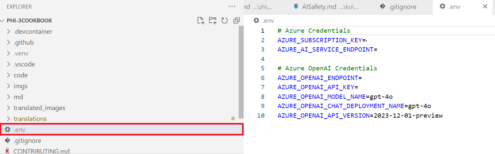
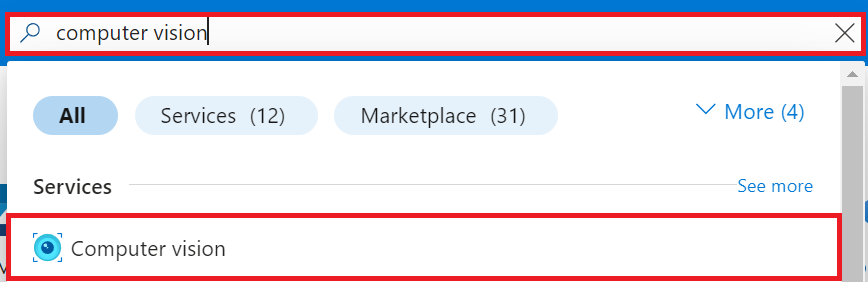
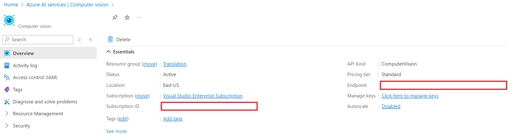
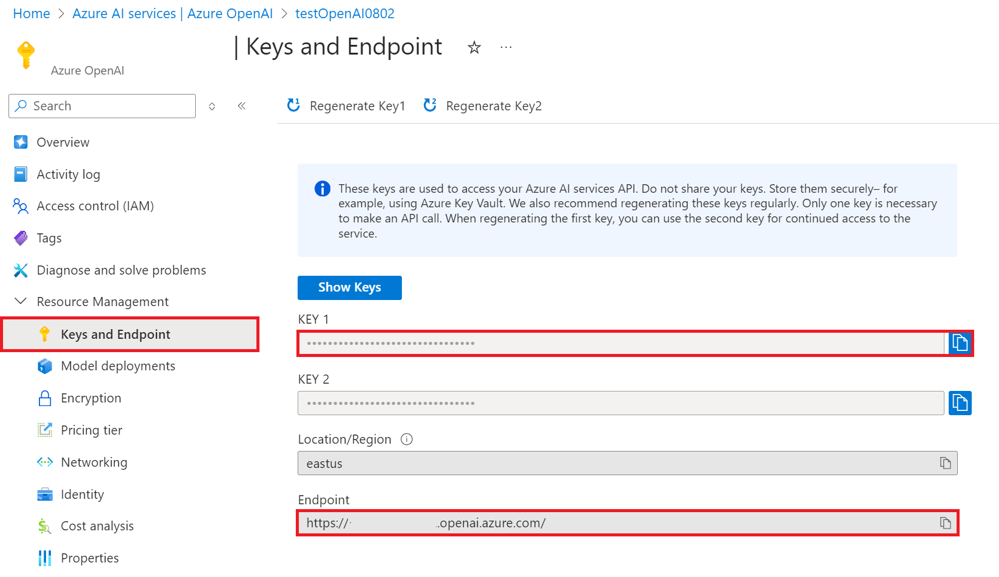
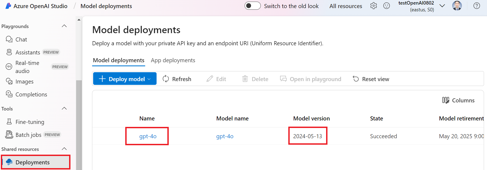

# 루트 디렉터리에 *.env* 파일 생성하기

이 튜토리얼에서는 *.env* 파일을 사용하여 Azure 서비스의 환경 변수를 설정하는 방법을 안내합니다. 환경 변수는 API 키와 같은 중요한 자격 증명을 코드베이스에 하드 코딩하지 않고 안전하게 관리할 수 있도록 도와줍니다.

## *.env* 파일 생성하기

프로젝트의 루트 디렉터리에 *.env* 파일을 생성합니다. 이 파일은 모든 환경 변수를 간단한 형식으로 저장할 것입니다.

> [!WARNING]
> *.env* 파일을 Git과 같은 버전 관리 시스템에 커밋하지 마세요. 실수로 커밋되는 것을 방지하기 위해 *.env* 파일을 .gitignore 파일에 추가하세요.

1. 프로젝트의 루트 디렉터리로 이동합니다.

1. 프로젝트의 루트 디렉터리에 *.env* 파일을 생성합니다.

    

1. *.env* 파일을 열고 다음 템플릿을 붙여넣습니다:

    ```plaintext
    # Azure Credentials
    AZURE_SUBSCRIPTION_KEY="your_azure_subscription_key"
    AZURE_AI_SERVICE_ENDPOINT="https://your_azure_ai_service_endpoint"
    
    # Azure OpenAI Credentials
    AZURE_OPENAI_API_KEY="your_azure_openai_api_key"
    AZURE_OPENAI_ENDPOINT="https://your_azure_openai_endpoint"
    AZURE_OPENAI_MODEL_NAME="your_model_name"
    AZURE_OPENAI_CHAT_DEPLOYMENT_NAME="your_deployment_name"
    AZURE_OPENAI_API_VERSION="your_api_version"
    ```

## Azure 자격 증명 수집하기

환경을 구성하려면 다음 Azure 자격 증명이 필요합니다:

1. Azure AI 서비스용:

    - Azure 구독 키: Azure AI 서비스에 접근할 수 있는 Azure 구독 키.
    - Azure AI 서비스 엔드포인트: 특정 Azure AI 서비스의 엔드포인트 URL.

1. Azure OpenAI 서비스용:

    - Azure OpenAI API 키: Azure OpenAI 서비스에 접근할 수 있는 API 키.
    - Azure OpenAI 엔드포인트: Azure OpenAI 서비스의 엔드포인트 URL.
    - Azure OpenAI 모델 이름: 상호작용할 모델의 이름.
    - Azure OpenAI 배포 이름: Azure OpenAI 모델의 배포 이름.
    - Azure OpenAI API 버전: 사용 중인 Azure OpenAI API 버전.

### Azure 환경 변수 추가하기

1. Azure 구독 키와 Azure AI 서비스 엔드포인트를 추가하려면 다음 작업을 수행하세요:

    - 포털 페이지 상단의 **검색창**에 *computer vision*을 입력하고 나타나는 옵션 중 **Computer vision**을 선택합니다.
        
    - 현재 사용 중인 Azure Computer Vision 리소스로 이동합니다.
    - 구독 키와 엔드포인트를 복사하여 *.env* 파일에 붙여넣습니다.
        

1. Azure OpenAI API 키와 엔드포인트를 추가하려면 다음 작업을 수행하세요:

    - 포털 페이지 상단의 **검색창**에 *azure openai*를 입력하고 나타나는 옵션 중 **Azure OpenAI**를 선택합니다.
        
    - 현재 사용 중인 Azure OpenAI 리소스로 이동합니다.
    - 왼쪽 탭에서 **Keys and Endpoint**를 선택합니다.
    - Azure OpenAI API 키와 엔드포인트를 복사하여 *.env* 파일에 붙여넣습니다.
        

1. Azure OpenAI 배포 이름과 버전을 추가하려면 다음 작업을 수행하세요:
    - 생성한 Azure OpenAI 리소스로 이동합니다.
    - 탐색 메뉴에서 **Go to Azure OpenAI Studio**를 선택합니다.
        

    - Azure OpenAI Studio 내에서 왼쪽 탭에서 **Deployments**를 선택합니다.
    - Azure OpenAI **이름**과 모델 **버전**을 복사하여 *.env* 파일에 붙여넣습니다.

        

1. *.env* 파일을 저장합니다.

1. 이제 이 환경 변수를 사용하여 Azure 서비스와 함께 **Co-op Translator**를 사용할 수 있습니다.
