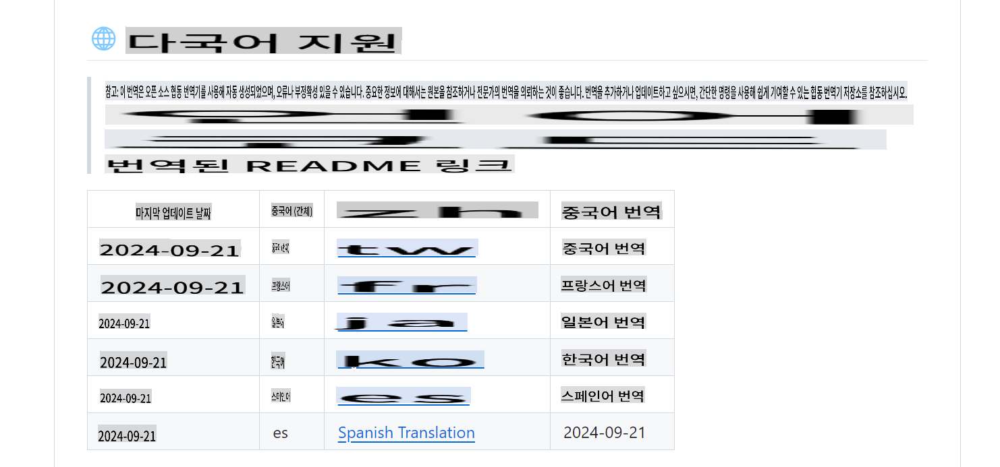
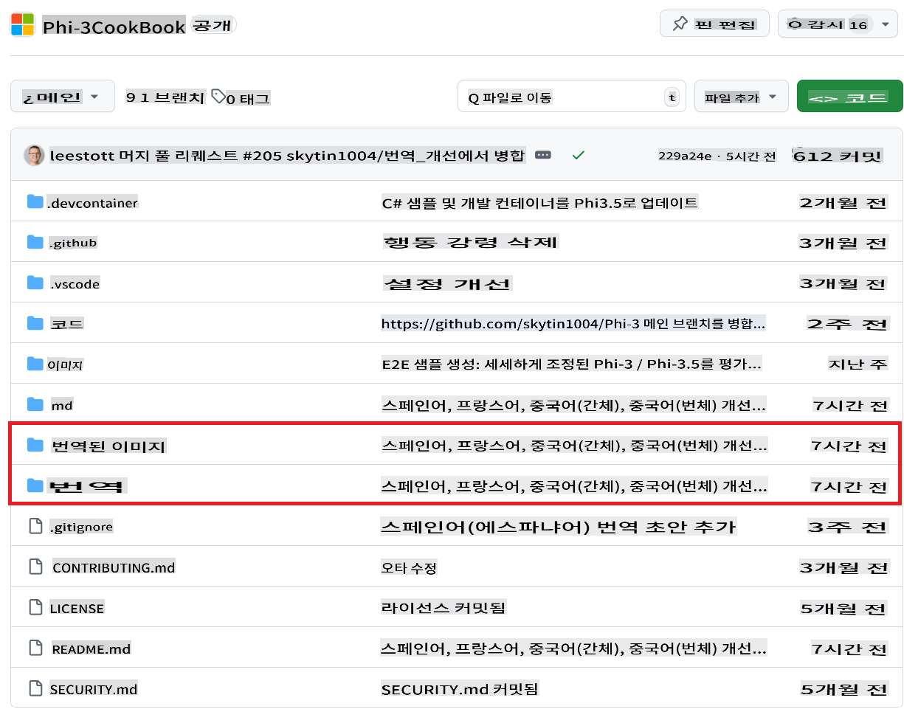
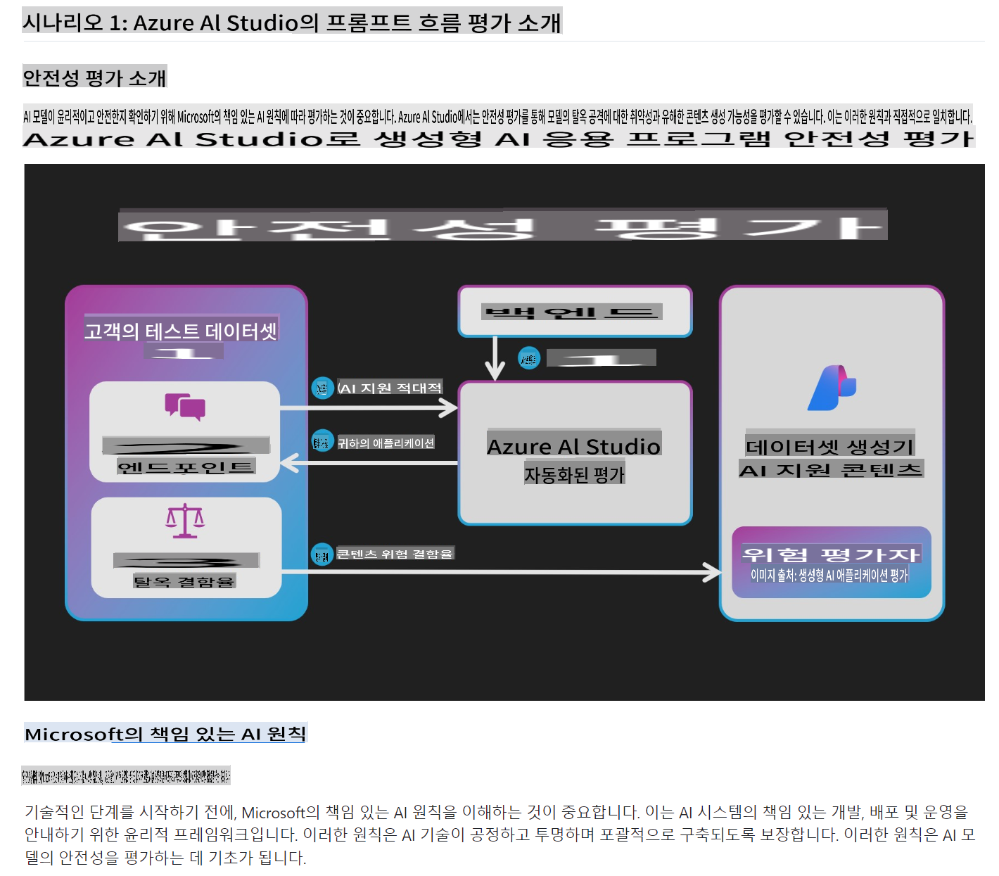

# Phi-3 Cookbook 번역: 사례 연구

**Phi-3 Cookbook**는 Phi-3 및 Phi-3.5 소형 언어 모델에 대한 자세한 지침을 제공하는 공식 오픈 소스 가이드입니다. 그 기술적 성격과 글로벌 AI 커뮤니티에 대한 중요성을 감안할 때, 이를 여러 언어로 번역하는 것은 영어를 모국어로 사용하지 않는 개발자와 연구자들이 이 귀중한 자원을 접근할 수 있게 하는 중요한 단계였습니다.

**Co-op Translator**를 사용하여 번역 프로세스를 간소화하고, Markdown 파일과 내장된 텍스트가 포함된 이미지를 여러 언어로 자동 변환할 수 있었습니다. 이 사례 연구에서는 **Phi-3 Cookbook**에 이 도구가 어떻게 적용되었는지, 직면한 도전 과제 및 구현된 솔루션에 대해 설명합니다.

## 번역 과정

1. **준비**: 먼저, **Phi-3 Cookbook**에서 Markdown 파일과 이미지 자산을 정리했습니다. 이전 버전에서 수동으로 번역된 파일을 제거하여 자동화 프로세스가 깨끗한 상태에서 시작되도록 했습니다. 이러한 파일을 남겨두면 불필요한 중복이 발생할 수 있습니다. 또한, 루트 디렉토리에 *.env* 파일을 만들어 번역에 필요한 Azure API 키와 구성 설정을 안전하게 저장했습니다.

1. **Azure 설정**: **Azure OpenAI**를 구성하여 Markdown 콘텐츠를 번역하고, **Azure Computer Vision**을 설정하여 이미지에서 텍스트를 추출하고 번역했습니다. 이 설정을 통해 Co-op Translator가 텍스트 기반 콘텐츠와 이미지 기반 콘텐츠를 자동으로 감지하고 처리할 수 있었습니다.

1. **Co-op Translator 설치**: `Poetry`를 사용하여 **Co-op Translator** 패키지를 설치하여 종속성을 관리했습니다.

1. **다국어 지원 설정**: 번역 과정을 시작하기 전에 README에 번역된 문서 버전으로 연결되는 표를 만들었습니다. 번역 중 Co-op Translator는 링크를 자동으로 조정하여 사용자가 번역된 페이지를 벗어나지 않고도 다른 언어 버전으로 원활하게 전환할 수 있도록 했습니다. 예를 들어, 사용자가 한국어 README로 이동하면 스페인어나 일본어 같은 다른 번역으로 쉽게 전환할 수 있습니다.

    ```markdown
    ## 🌐 Multi-Language Support
    
    > **Note:**
    > These translations were automatically generated using the open-source [co-op-translator](https://github.com/Azure/co-op-translator) and may contain errors or inaccuracies. For critical information, it is recommended to refer to the original or consult a professional human translation. If you'd like to add or update a translation, please refer to the [co-op-translator](https://github.com/Azure/co-op-translator) repository, where you can easily contribute using simple commands.
    
    | Language             | Code | Link to Translated README                               | Last Updated |
    |----------------------|------|---------------------------------------------------------|--------------|
    | Chinese (Simplified) | zh   | [Chinese Translation](../zh/README.md)      | 2024-10-04   |
    | Chinese (Traditional)| tw   | [Chinese Translation](../tw/README.md)      | 2024-10-04   |
    | French               | fr   | [French Translation](../fr/README.md)       | 2024-10-04   |
    | Japanese             | ja   | [Japanese Translation](../ja/README.md)     | 2024-10-04   |
    | Korean               | ko   | [Korean Translation](./README.md)       | 2024-10-04   |
    | Spanish              | es   | [Spanish Translation](../es/README.md)      | 2024-10-04   |
    ```

    

1. **Co-op Translator를 사용한 실행**: **Co-op Translator**를 사용하여 `translate` command with the appropriate language codes, such as Spanish (`es`), French (`fr`), Korean (`ko`와 같은 명령어를 실행하여 번역 프로세스를 시작했습니다.

   - Markdown 파일은 **Azure OpenAI**를 사용하여 번역되었습니다.
   - **Azure Computer Vision**을 사용하여 이미지에서 텍스트를 추출하고, **Azure OpenAI**를 사용하여 추출된 텍스트를 번역했습니다.
   - 번역된 Markdown 및 이미지 파일은 언어별 전용 폴더에 저장되었습니다.
   - 아래는 Phi-3 Cookbook의 한국어 번역이 생성된 예시입니다:

    ```bash
    (.venv) C:\Users\sms79\dev\Phi-3CookBook>translate -l "ko"
    Translating images: 100%|███████████████████████████████████████████████████| 276/276 [1:09:56<00:00, 15.37s/it]
    Translating markdown files: 100%|███████████████████████████████████████████| 153/153 [1:43:07<00:00, 241.31s/it]
    ```

   - 이 예시에서 **Co-op Translator**는 한국어 번역을 위해 276개의 이미지와 153개의 Markdown 파일을 처리하고 결과를 적절한 언어 폴더에 자동으로 저장했습니다.

1. **검토**: 번역이 완료된 후 정확성을 검토했습니다. 자동화된 프로세스는 높은 품질의 번역을 생성하여 수동 조정의 필요성을 크게 줄였습니다.

> [!NOTE]
> 번역이 완료되면 루트 디렉토리에서 `translations` and `translated_images` 폴더를 찾을 수 있습니다. **Phi-3 Cookbook**의 폴더 구조 예시는 다음과 같습니다:
> 

## 도전 과제와 해결책

과정이 대부분 원활했지만 몇 가지 도전 과제가 있었습니다:

- **많은 코드 블록이 있는 파일 처리**: 일부 Markdown 파일에는 많은 코드 블록이 포함되어 있었습니다. 번역 중 도구가 콘텐츠를 청크로 나누는데, 코드 블록 내에서 분할이 발생하면 번역된 출력이 종종 깨지곤 했습니다. 이를 해결하기 위해 코드 블록을 일시적으로 자리 표시자로 대체하고 번역 중에 건너뛰는 솔루션을 구현했습니다. 향후 버전에서는 코드 블록 내의 주석을 번역하는 기능을 개선할 계획입니다. 이를 위해 코드 블록을 나머지 Markdown과 분리하고 각 부분을 정확하게 번역한 후 최종 번역 파일에 다시 통합할 것입니다.

- **이미지에서 텍스트 추출**: 복잡한 이미지에서 텍스트를 추출하고 번역하는 것은 특히 이미지에 작은 영역에 많은 텍스트가 있을 때 어려웠습니다. 이는 번역된 텍스트가 지나치게 늘어나거나 압축되어 가독성에 영향을 미치는 경우가 많았습니다. 이러한 문제를 완화하기 위해 노력했지만, 더 높은 정확성을 보장하기 위해 이 분야에서 추가 개선이 필요합니다.

## 결과

**Phi-3 Cookbook**의 번역은 성공적이었습니다. 이제 여러 언어로 번역된 버전을 볼 수 있습니다. 번역된 **Phi-3 Cookbook**을 보고 싶다면 **[Phi-3CookBook](https://github.com/microsoft/Phi-3CookBook?tab=readme-ov-file#-multi-language-support)**를 방문할 수 있습니다. 이 링크는 **Phi-3 Cookbook**의 다국어 버전으로 이동합니다.

아래는 **Co-op Translator**를 사용하여 한국어로 번역된 **Phi-3 Cookbook**의 Markdown 예시입니다:



**면책 조항**:
이 문서는 기계 기반 AI 번역 서비스를 사용하여 번역되었습니다. 정확성을 위해 노력하고 있지만 자동 번역에는 오류나 부정확성이 있을 수 있습니다. 원본 문서는 해당 언어로 작성된 문서를 권위 있는 출처로 간주해야 합니다. 중요한 정보에 대해서는 전문적인 인간 번역을 권장합니다. 이 번역 사용으로 인해 발생하는 오해나 오역에 대해 책임지지 않습니다.