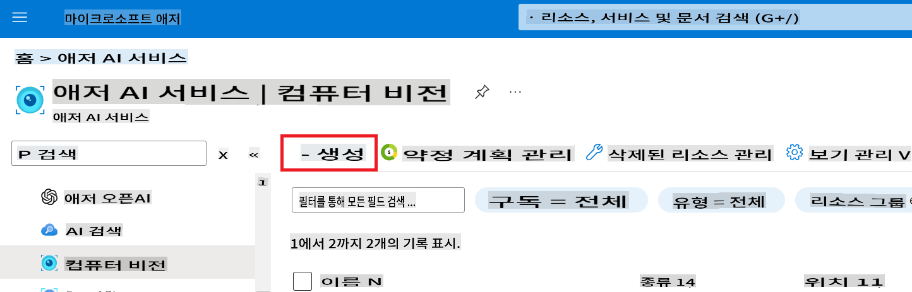
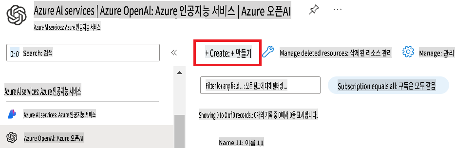
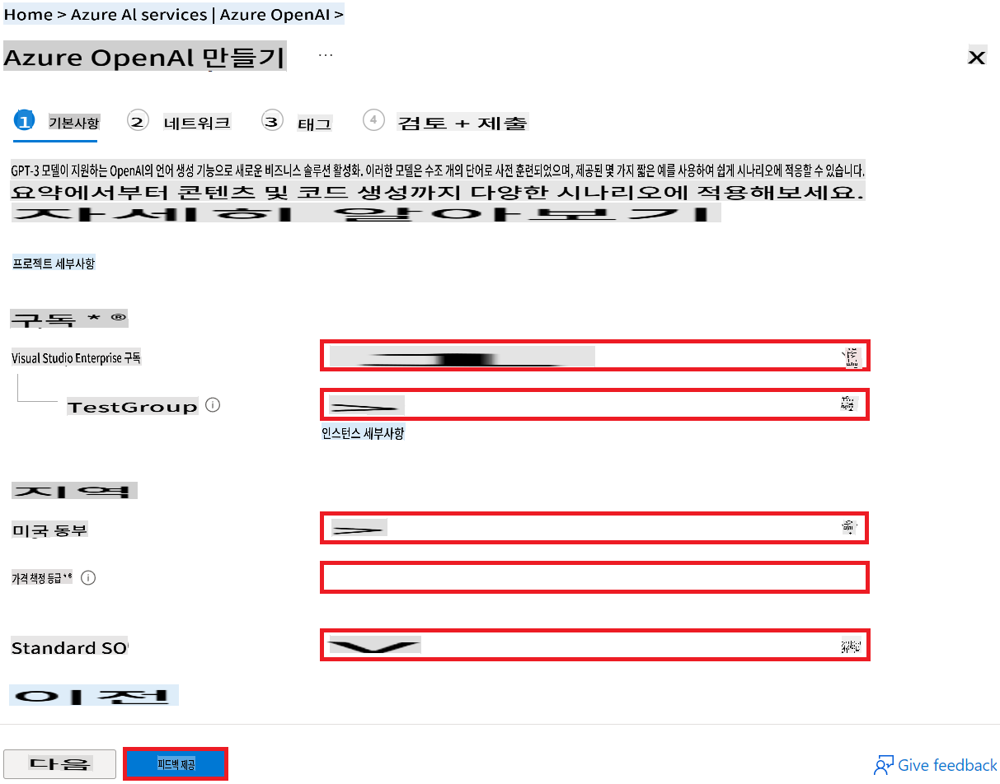
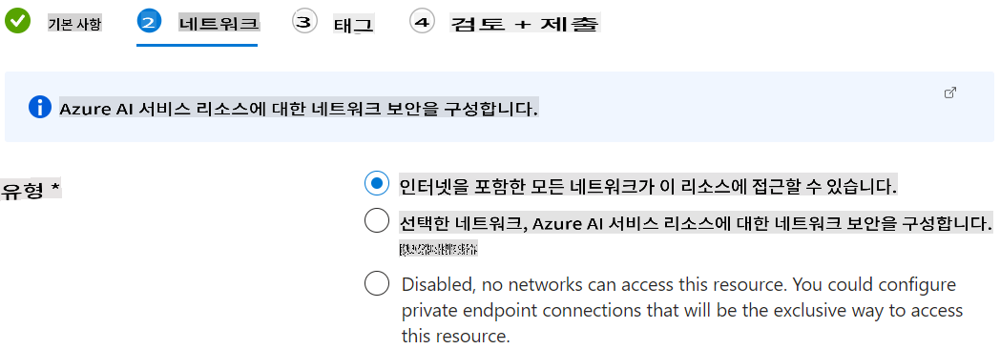
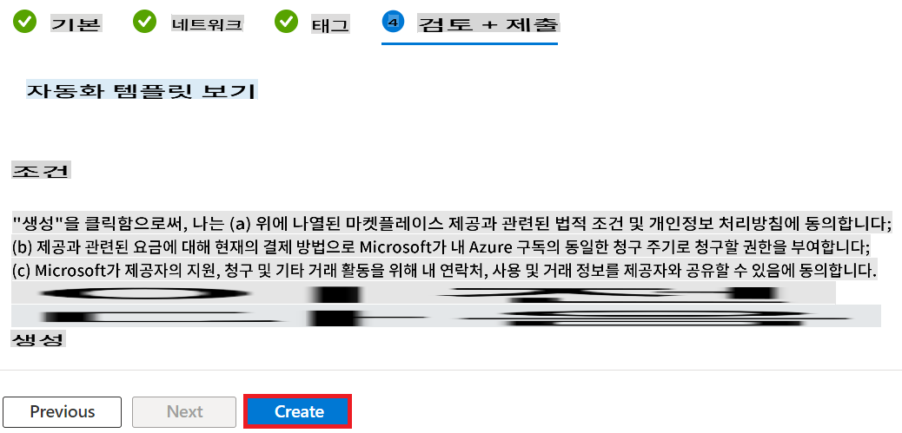
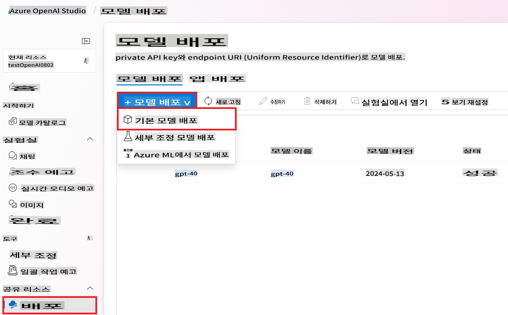
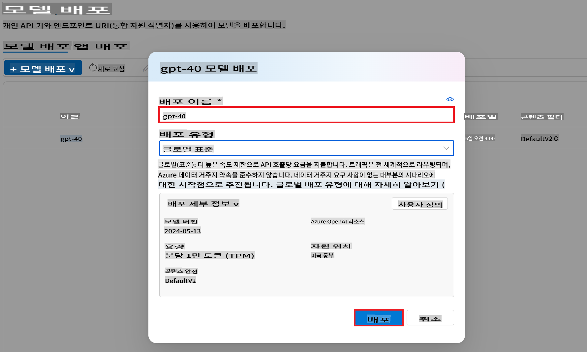

# Azure 리소스 설정 가이드

이 가이드는 Co-op Translator를 사용하기 위해 필요한 Azure 리소스를 설정하는 단계를 안내합니다. Azure Computer Vision 리소스와 Azure OpenAI 리소스를 생성하여 패키지에 필요한 번역 기능을 제공합니다.

### Azure 계정 만들기

Azure 계정이 아직 없으면 하나 만들어야 합니다.

1. **[Azure 가입](https://azure.microsoft.com/free/) 페이지로 이동합니다.**
2. **무료로 Azure 체험하기** 또는 **종량제**를 선택합니다.
3. **화면의 지시에 따라** 계정을 만듭니다.
   - 개인 정보 및 연락처 정보를 제공합니다.
   - **인증:** 신용카드나 전화번호를 사용하여 신원을 인증해야 합니다.

### Azure Computer Vision 리소스 생성

1. [Azure 포털](https://portal.azure.com/)에 로그인합니다.

1. 포털 페이지 상단의 **검색창**에 *computer vision*을 입력하고 나타나는 옵션 중 **Computer vision**을 선택합니다.

    

1. 탐색 메뉴에서 **+ 생성**을 선택합니다.

    

1. 다음 작업을 수행합니다:

    - Azure **구독**을 선택합니다.
    - 사용할 **리소스 그룹**을 선택합니다 (필요 시 새로 만듭니다).
    - 사용할 **지역**을 선택합니다.
    - **이름**을 입력합니다. 고유한 값이어야 합니다.
    - 사용할 **가격 책정 계층**을 선택합니다.

    

1. **검토 + 생성**을 선택합니다.

1. **생성**을 선택합니다.

### Azure OpenAI 리소스 생성

1. 포털 페이지 상단의 **검색창**에 *azure openai*를 입력하고 나타나는 옵션 중 **Azure OpenAI**를 선택합니다.

    

1. 탐색 메뉴에서 **+ 생성**을 선택합니다.

    

1. 다음 작업을 수행합니다:

    - Azure **구독**을 선택합니다.
    - 사용할 **리소스 그룹**을 선택합니다 (필요 시 새로 만듭니다).
    - 사용할 **지역**을 선택합니다.
    - **이름**을 입력합니다. 고유한 값이어야 합니다.
    - 사용할 **가격 책정 계층**을 선택합니다.

    

1. **다음**을 선택하여 **네트워크** 페이지로 이동합니다.

1. 사용할 네트워크 보안 **유형**을 선택합니다.

    

1. **다음**을 선택하여 **태그** 페이지로 이동합니다.

1. **다음**을 선택하여 **검토 + 제출** 페이지로 이동합니다.

1. **생성**을 선택합니다.

    

### Azure OpenAI 모델 배포

1. 생성한 Azure OpenAI 리소스로 이동합니다.

1. 탐색 메뉴에서 **Azure OpenAI Studio로 이동**을 선택합니다.

    

1. Azure OpenAI Studio에서 왼쪽 탭의 **배포**를 선택합니다.
1. 탐색 메뉴에서 **+ 모델 배포**를 선택합니다.
1. 탐색 메뉴에서 **기본 모델 배포**를 선택하여 새 **gpt-4o** 배포를 만듭니다.

    

1. 다음 작업을 수행합니다:

    - **모델 선택** 페이지에서 **gpt-4o**를 선택합니다.
    - **확인**을 선택하여 **모델 gpt-4o 배포** 페이지로 이동합니다.
    - **모델 gpt-4o 배포** 페이지에서 **배포 이름**을 입력합니다. 고유한 값이어야 합니다. 예를 들어, **gpt-4o**.
    - **모델 gpt-4o 배포** 페이지에서 사용할 **배포 유형**을 선택합니다.

    

1. **배포**를 선택합니다.

**면책 조항**:
이 문서는 기계 기반 AI 번역 서비스를 사용하여 번역되었습니다. 우리는 정확성을 위해 노력하지만, 자동 번역에는 오류나 부정확성이 포함될 수 있음을 유의하시기 바랍니다. 원본 문서의 원어를 권위 있는 자료로 간주해야 합니다. 중요한 정보에 대해서는 전문적인 인간 번역을 권장합니다. 이 번역을 사용하여 발생하는 오해나 오역에 대해 당사는 책임을 지지 않습니다.